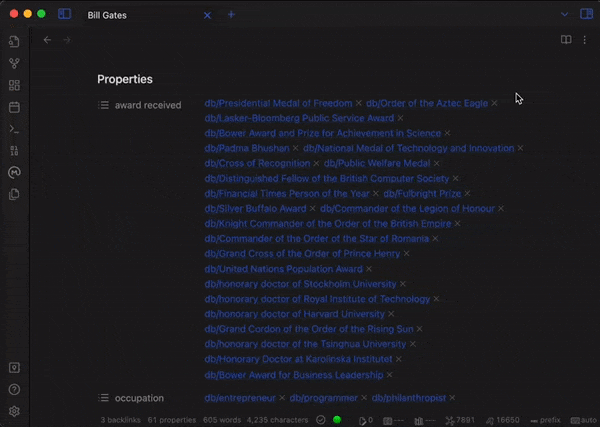

# Obsidian Wikidata Importer

This plugin pulls data from the Wikidata database into your Obsidian notes.
All you need to do is add a `wikidata entity id` property to a note,
then run the `Wikidata Importer: Import properties for active file` command
and viola. Your note now has all of the Wikidata properties as properties
on the note.

You can also import new Wikidata entries with the command `Wikidata Importer: Import entity`

